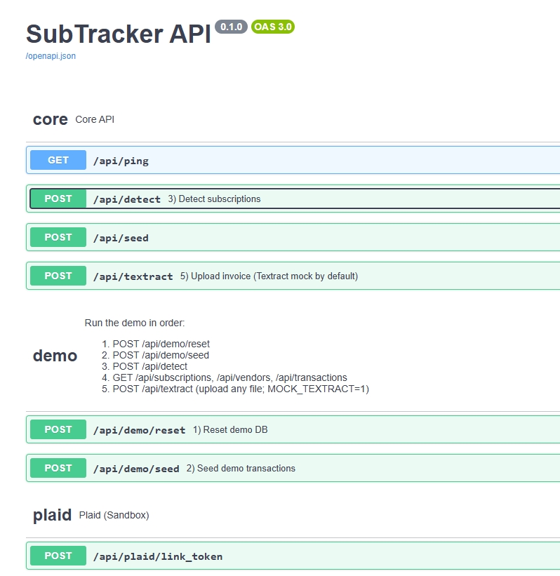

# SubTracker (MVP)

SubTracker is a local-first subscription tracking backend demo focused on privacy, explainability, and realistic fintech workflows.
It ingests transaction data (seeded or Plaid Sandbox), detects recurring subscriptions, and parses invoices via AWS Textract (mocked by default).

Highlights:

- End-to-end subscription detection pipeline
- Privacy-first design (local SQLite, no real bank data by default)
- Testable REST API with OpenAPI / Swagger UI
- Deterministic demo flows (seeded data + mock OCR)
- Production-oriented structure (tests, CI, Docker)

## Quickstart (Docker - recommended for interviews)

```bash
docker compose up --build
```

Open:

- `http://localhost:5000/docs`

## Quickstart (local - optional)

Prerequisites: Python 3.10-3.12 (recommended 3.11). Note: SQLAlchemy 2.0.x does not support Python 3.13/3.14 yet.

```bash
cd backend
pip install -r requirements.txt
copy .env.example .env
python app.py
```

API docs:

- Swagger UI: `http://localhost:5000/docs`
- OpenAPI JSON: `http://localhost:5000/openapi.json`
- ReDoc (read-only): `http://localhost:5000/redoc`

## Demo in Swagger UI (step-by-step)

Open `http://localhost:5000/docs` and run in order:

### Swagger demo flow



1. Reset demo DB  
   `POST /api/demo/reset` -> Execute  
   Expected: `{ "ok": true, "reset": true }`

2. Seed demo transactions  
   `POST /api/demo/seed` -> Execute  
   Expected: `{ "ok": true, "inserted": 12 }`

3. Detect subscriptions  
   `POST /api/detect` -> Execute  
   Expected: 3 subscriptions (Netflix, Adobe Inc., Spotify). Starbucks is filtered as noise.

4. View results  
   `GET /api/subscriptions`  
   `GET /api/vendors`  
   `GET /api/transactions` (optional `limit=50`)

5. Invoice ingestion (mock)  
   `POST /api/textract` -> upload any file  
   Expected: mock invoice for "Adobe Inc." (MOCK_TEXTRACT=1).

Tip: If you seed more than once, run `POST /api/demo/reset` first to avoid duplicate dates confusing detection.

## Plaid Sandbox flow (optional)

Put Plaid sandbox creds into `backend/.env` (see `backend/.env.example`):

- `PLAID_CLIENT_ID=...`
- `PLAID_SECRET=...`

Run:

1. `POST /api/plaid/sandbox_public_token`
2. `POST /api/plaid/exchange` with body `{"public_token":"..."}`
3. `GET /api/plaid/transactions`
4. `POST /api/detect`

## Tests

```bash
cd backend
pytest
```

Includes smoke tests (API demo flow) and a unit test for subscription detection. CI runs via GitHub Actions: `.github/workflows/tests.yml`.

## Where the logic lives

- DB models: `backend/models.py`
- Subscription detection heuristic: `backend/detection.py`
- API routes + Swagger bindings: `backend/api_routes.py`, `backend/api_schemas.py`
- App bootstrap + OpenAPI config: `backend/app.py`
